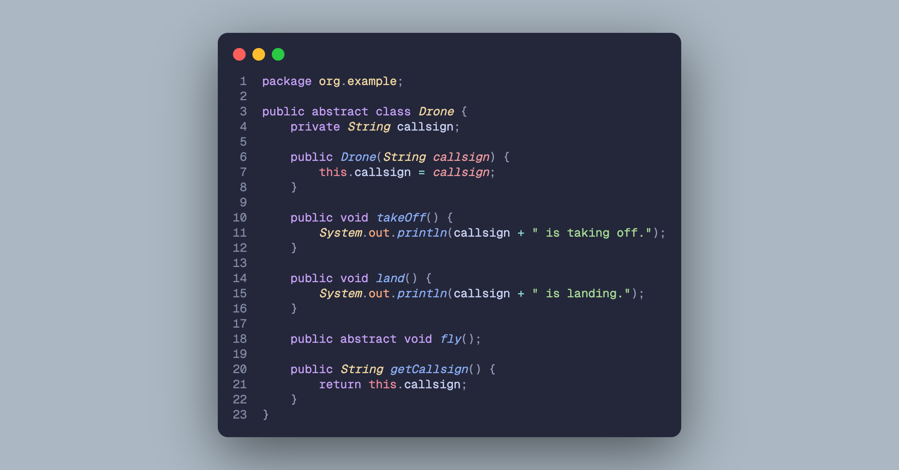
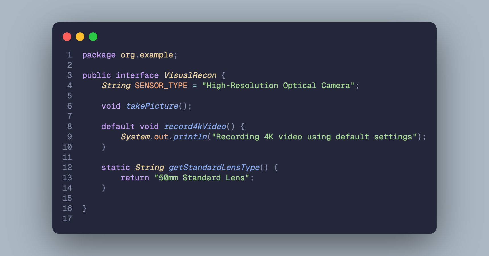
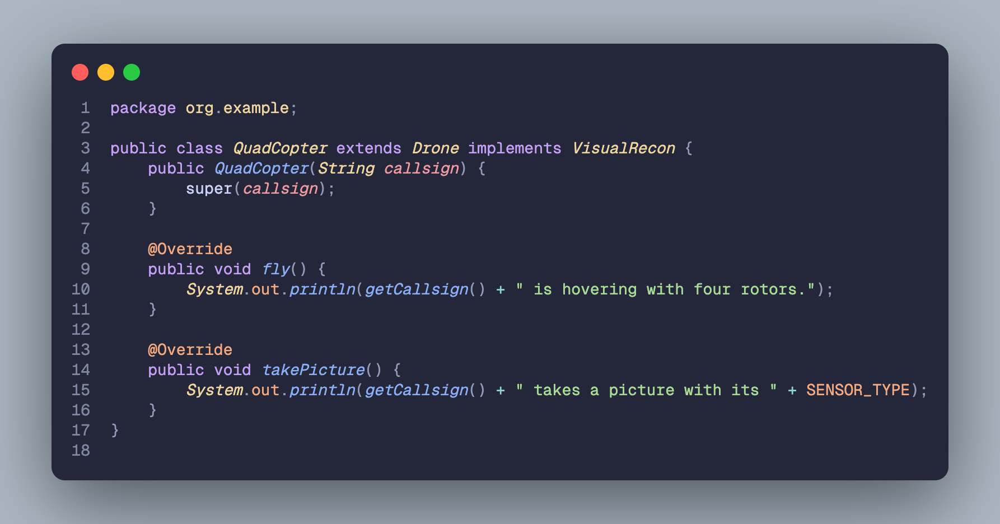
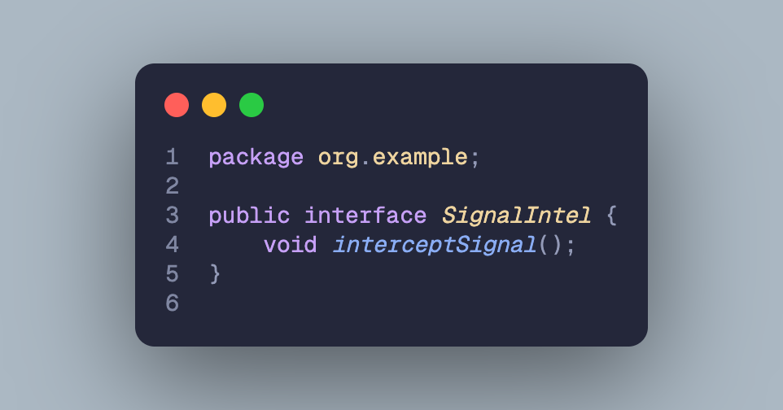
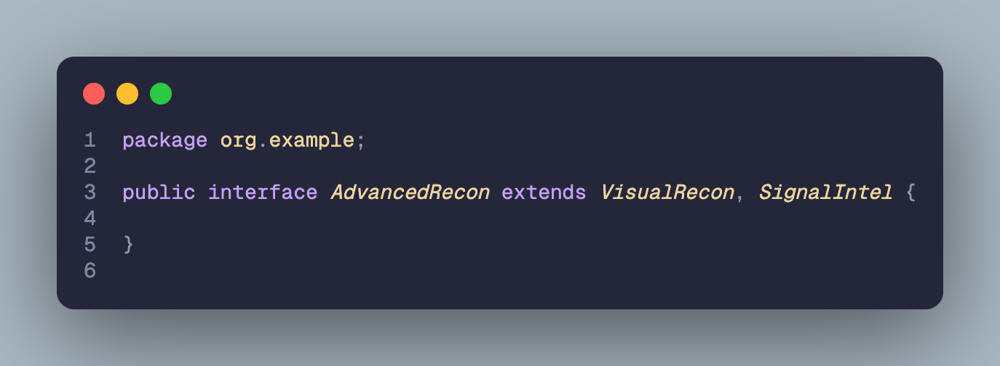
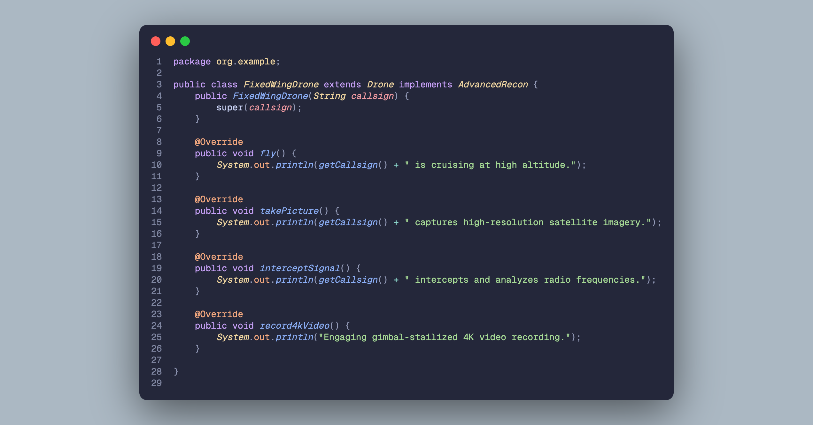
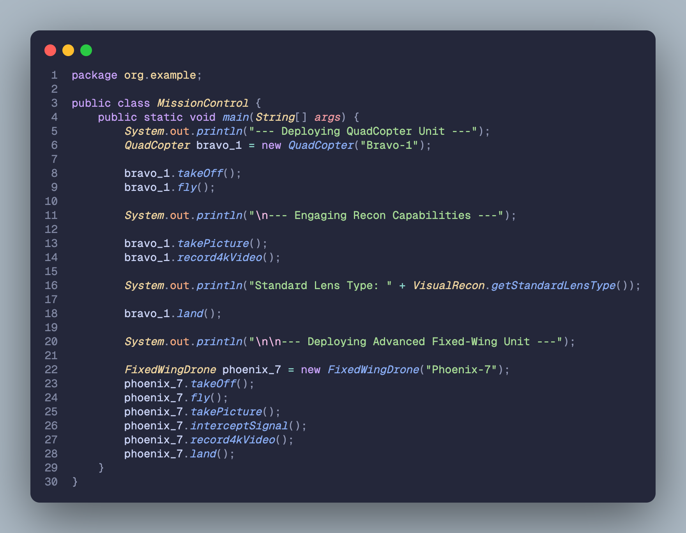

# Cadet Training Module: Java Inheritance and Interfaces

## Godfrey Angelo A. Convento

### Classes

#### `Drone.java`

#### `VisualRecon.java`

#### `QuadCopter.java`

#### `SignalIntel.java`

#### `AdvancedRecon.java`

#### `FixedWingDrone.java`

#### `MissionControl.java`

